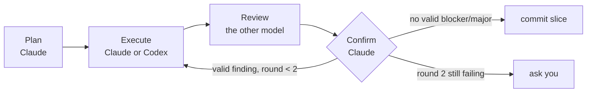

# colaudex

**One model builds. Another checks. Claude decides.**

A [Claude Code](https://claude.com/claude-code) skill that splits work into slices, has Claude or Codex execute each one, has the *other* model review it, and then makes Claude reproduce every review finding before anything is committed. It works for code and for papers.

[Project page](https://yuxiaoma66.github.io/colaudex/) · [中文说明](README.zh-CN.md) · [Changelog](CHANGELOG.md)



## Why

- A model reviewing its own output tends to agree with itself. A different model family catches different mistakes.
- Reviewers also make claims they cannot back up. So a review is evidence, not a verdict: Claude reruns the tests, opens each quoted line, and marks every finding VALID or INVALID.
- Everything goes through files in `.colab/`, so executors and reviewers never see the conversation, and a crashed session can resume from `STATE.md`.

## How it works

1. **Plan.** Claude writes `.colab/PLAN.md`: requirements, then slices of about half an hour each, each with a file scope, steps, and acceptance commands. You approve it.
2. **Choose.** For each slice you pick a combo and a tier (or apply one choice to the whole phase).
3. **Execute.** The executor gets a self-contained handoff plus strict rules: touch only the listed files, never run git, never weaken tests, report `BLOCKED` instead of improvising.
4. **Review.** A fresh, read-only reviewer returns schema-checked JSON. Every finding carries a severity and quoted evidence.
5. **Confirm.** Claude reproduces findings, adds anything missed, and either commits the in-scope files or sends the slice back with a Rework section. After two rounds it escalates to you.

### Combos

|  | reviewed by Claude | reviewed by Codex |
|---|---|---|
| **Claude executes** | A | **B**: judgment-heavy slices |
| **Codex executes** | **C**: well-specified slices | D |

### Tiers

| tier | Codex exec | Codex review | Claude exec | Claude review |
|---|---|---|---|---|
| light | luna, medium | sol, medium | sonnet, low | opus, medium |
| standard | luna, high | sol, medium | sonnet, medium | opus, medium |
| heavy | sol, medium | astra, medium (×2) | opus, medium | opus, high (×2) |
| test | luna, low | luna, low | haiku | haiku |

Heavy adds a second reviewer with a different focus. Paper slices execute with a stronger fixed model on every tier except `test`. Edit `skill/config.json` to change the mapping.

## Install

Requires Claude Code, git and Python 3. Codex CLI (logged in) is needed for combos B, C and D.

```bash
git clone https://github.com/YuxiaoMa66/colaudex.git
cd colaudex
ln -s "$PWD/skill" ~/.claude/skills/colaudex
for f in agents/colaudex-*.md; do ln -s "$PWD/$f" ~/.claude/agents/; done
```

The symlinks keep edits in the clone live. New agent files can take a few minutes to load in a running session.

## Use

In any git repository, ask Claude Code:

```text
colaudex: add rate limiting to the API. Plan it in slices, Codex executes, Claude reviews.
```

Useful commands while a run is going:

```bash
python3 ~/.claude/skills/colaudex/scripts/codex_run.py stats      # time and tokens per run
python3 ~/.claude/skills/colaudex/scripts/codex_run.py preflight  # is Codex reachable?
```

`.colab/` is excluded from git through `.git/info/exclude` and kept as the audit trail: plan, state, handoffs, raw runs, reviews and confirmations.

## What the tests showed

From a fault-injection run (`test` tier) and two paper runs:

- A cheap reviewer passed a CLI that crashed on `--top -1`; confirmation reproduced it and forced a rework.
- An executor given a CLI task without `cli.py` in scope reported `BLOCKED` instead of editing it.
- After the orchestrator and Codex were killed mid-slice, a fresh session with only `STATE.md` resumed the Codex thread and finished.
- A planted wrong venue in a `.bib` file was caught by Codex with web search. A Haiku reviewer passed without searching until the template required `Citations verified online: k/n`.
- About 89% of Codex executor input tokens were cached, so the fixed per-call overhead is small.

## Layout

```text
skill/     SKILL.md, config.json, scripts/codex_run.py, templates/, schemas/
agents/    Claude executor and reviewer subagents (model and effort in frontmatter)
docs/      project page (GitHub Pages)
```

## License

MIT
