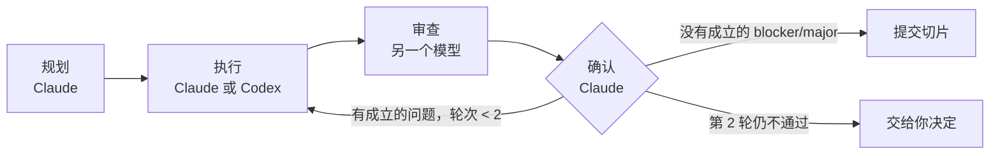

# colaudex

**一个模型执行，另一个审查，Claude 拍板。**

这是一个 [Claude Code](https://claude.com/claude-code) skill：把工作拆成小切片，由 Claude 或 Codex 执行，再由*另一个*模型审查；每条审查意见都要 Claude 亲自复现，确认后才提交。代码和论文都适用。

[项目主页](https://yuxiaoma66.github.io/colaudex/) · [English](README.md) · [更新记录](CHANGELOG.md)



## 为什么这样设计

- 模型审查自己的产出，往往会认同自己。换一个模型家族，能发现不同的错误。
- 审查者也会提出站不住的意见。所以审查结果只是证据，不是结论：Claude 会重跑测试、打开被引用的代码行，把每条意见标记为成立（VALID）或不成立（INVALID）。
- 所有交接都通过 `.colab/` 里的文件完成。执行者和审查者看不到对话；会话崩溃后可以从 `STATE.md` 接着跑。

## 工作流程

1. **规划。** Claude 写出 `.colab/PLAN.md`：需求，以及若干个约半小时的切片，每个切片都有文件范围、步骤和验收命令。由你批准。
2. **选择。** 每个切片选一个组合和一个档位（也可以一次应用到整个阶段）。
3. **执行。** 执行者拿到一份自足的交接文件和严格规则：只改清单里的文件，不碰 git，不削弱测试，遇到越界需求就报告 `BLOCKED`，不自作主张。
4. **审查。** 全新上下文、只读的审查者输出经 schema 校验的 JSON，每条意见都附严重级别和原文证据。
5. **确认。** Claude 复现意见、补充遗漏，然后提交范围内的文件，或者带着返工清单退回。两轮之后交给你决定。

### 组合

|  | Claude 审查 | Codex 审查 |
|---|---|---|
| **Claude 执行** | A | **B**：需要判断力的切片 |
| **Codex 执行** | **C**：规格清楚的切片 | D |

### 档位

| 档位 | Codex 执行 | Codex 审查 | Claude 执行 | Claude 审查 |
|---|---|---|---|---|
| 轻 light | luna, medium | sol, medium | sonnet, low | opus, medium |
| 标准 standard | luna, high | sol, medium | sonnet, medium | opus, medium |
| 重 heavy | sol, medium | astra, medium（两位） | opus, medium | opus, high（两位） |
| 测试 test | luna, low | luna, low | haiku | haiku |

重档会增加一位侧重点不同的审查者。论文切片除测试档外，一律用更强的固定模型执行。映射关系可在 `skill/config.json` 中修改。

## 安装

需要 Claude Code、git 和 Python 3。B、C、D 组合还需要已登录的 Codex CLI。

```bash
git clone https://github.com/YuxiaoMa66/colaudex.git
cd colaudex
ln -s "$PWD/skill" ~/.claude/skills/colaudex
for f in agents/colaudex-*.md; do ln -s "$PWD/$f" ~/.claude/agents/; done
```

软链接让克隆目录里的修改即时生效。新的 agent 文件在已运行的会话里可能要过几分钟才能加载。

## 使用

在任意 git 仓库里对 Claude Code 说：

```text
colaudex：给 API 加限流。拆成切片，Codex 执行，Claude 审查。
```

运行中常用的命令：

```bash
python3 ~/.claude/skills/colaudex/scripts/codex_run.py stats      # 每次运行的耗时和 token
python3 ~/.claude/skills/colaudex/scripts/codex_run.py preflight  # Codex 是否可用
```

`.colab/` 通过 `.git/info/exclude` 排除在 git 之外，作为审计记录保留：计划、状态、交接文件、原始运行记录、审查和确认结果。

## 测试中发现了什么

来自一次故障注入演练（测试档）和两次论文测试：

- 便宜的审查者放过了一个 `--top -1` 会崩溃的 CLI，确认环节复现后强制返工。
- 执行者接到 CLI 任务但范围里没有 `cli.py`，它报告了 `BLOCKED`，没有越界修改。
- 编排者和 Codex 在切片中途被杀掉后，一个只有 `STATE.md` 的新会话续接了 Codex 线程并完成了任务。
- `.bib` 里埋下的错误会议名被带联网搜索的 Codex 抓到。Haiku 审查者在模板要求写明"已联网核实 k/n"之前，没搜索就给了通过。
- Codex 执行调用约 89% 的输入 token 命中缓存，每次调用的固定开销很小。

## 目录结构

```text
skill/     SKILL.md、config.json、scripts/codex_run.py、templates/、schemas/
agents/    Claude 执行者和审查者子代理（模型和 effort 写在 frontmatter）
docs/      项目主页（GitHub Pages）
```

## 许可

MIT
